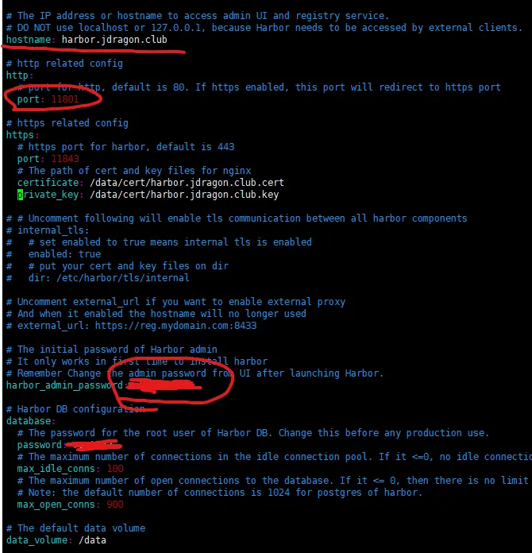

## 使用 docker-compose 安装harbor
### 先决条件：
* 安装docker
* 安装docker-compose

#### 安装 docker
参考 https://docs.docker.com/engine/install/ubuntu/

1、Set up Docker's apt repository.
```
# Add Docker's official GPG key:
sudo apt-get update
sudo apt-get install ca-certificates curl
sudo install -m 0755 -d /etc/apt/keyrings
sudo curl -fsSL https://download.docker.com/linux/ubuntu/gpg -o /etc/apt/keyrings/docker.asc
sudo chmod a+r /etc/apt/keyrings/docker.asc

# Add the repository to Apt sources:
echo \
  "deb [arch=$(dpkg --print-architecture) signed-by=/etc/apt/keyrings/docker.asc] https://download.docker.com/linux/ubuntu \
  $(. /etc/os-release && echo "$VERSION_CODENAME") stable" | \
  sudo tee /etc/apt/sources.list.d/docker.list > /dev/null
sudo apt-get update
```
2、Install the Docker packages.
To install the latest version, run:
```
sudo apt-get install docker-ce docker-ce-cli containerd.io docker-buildx-plugin docker-compose-plugin
```
3、Verify that the Docker Engine installation is successful by running the hello-world image.
```
 sudo docker run hello-world
```

#### [可选] 安装 docker-compose
参考 https://docs.docker.com/compose/install/standalone/

1、To download and install Compose standalone, run:
```
 curl -SL https://github.com/docker/compose/releases/download/v2.24.7/docker-compose-linux-x86_64 -o /usr/local/bin/docker-compose
```
2、Apply executable permissions to the standalone binary in the target path for the installation.

3、Test and execute compose commands using docker-compose.

>Tip：If the command docker-compose fails after installation, check your path. You can also create a symbolic link to /usr/bin or any other directory in your path. For example:
```
 sudo ln -s /usr/local/bin/docker-compose /usr/bin/docker-compose
```

## 安装 Harbor
1、下载并解压
```
wget -c https://github.com/goharbor/harbor/releases/download/v2.3.5/harbor-offline-installer-v2.3.5.tgz

tar -zxvf harbor-offline-installer-v2.3.5.tgz
```
2、修改 harbor配置文件
```
cd harbor
cp harbor.yml.tmpl harbor.yml
```


按照图中红线，修改配置文件中的`hostname,http.port,harbor_admin_password`，并将https的配置注释掉，然后运行`./prepare,./install.sh`等待后即可安装成功。

## 安装 nerdctl
```
wget https://github.com/containerd/nerdctl/releases/download/v1.1.0/nerdctl-1.1.0-linux-amd64.tar.gz
tar -zxvf nerdctl-1.1.0-linux-amd64.tar.gz
mv nerdctl /usr/local/bin/
```
使用nerdctl登录harbor
```
nerdctl login -u admin harbor.kubeagi.com:11843
```

[鸣谢](https://www.jianshu.com/p/21ec1cec93cf)