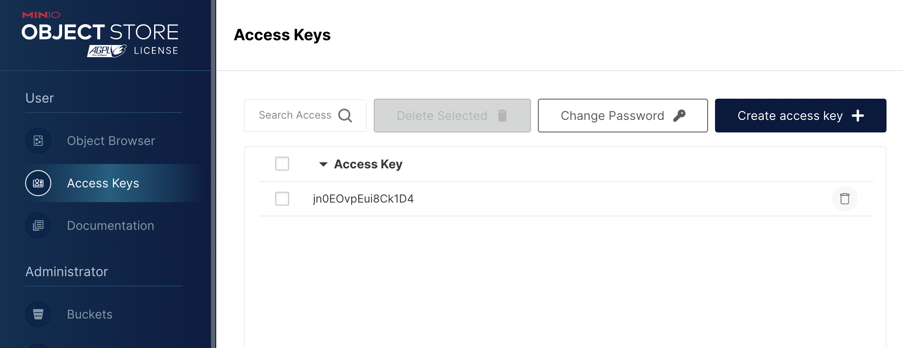
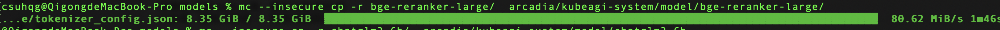
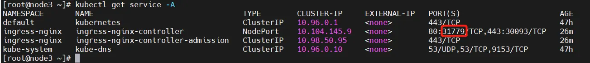

## 安装前的检查
1、确认操作系统版本
```root@k8s-node2:~# lsb_release -a
LSB Version:    core-11.1.0ubuntu4-noarch:security-11.1.0ubuntu4-noarch
Distributor ID: Ubuntu
Description:    Ubuntu 22.04.3 LTS
Release:        22.04
Codename:       jammy
root@k8s-node2:~# uname -a
Linux k8s-node2 5.15.0-92-generic #102-Ubuntu SMP Wed Jan 10 09:33:48 UTC 2024 x86_64 x86_64 x86_64 GNU/Linux`
```

2、apt update
3、修改 /etc/hosts
```
192.168.0.245  k8s-master1
192.168.0.247  k8s-node1
192.168.0.246  k8s-node2
192.168.0.241  k8s-node3-gpu1
```
4、暂时禁用交换分区
> sudo swapoff -a

5、确保每个节点上 MAC 地址和 product_uuid 的唯一性 
> 使用命令 ip link 或 ifconfig -a 来获取网络接口的 MAC 地址 ，可以使用 sudo cat /sys/class/dmi/id/product_uuid 命令对 product_uuid 校验 。一般来讲，硬件设备会拥有唯一的地址，但是有些虚拟机的地址可能会重复。 Kubernetes 使用这些值来唯一确定集群中的节点。 如果这些值在每个节点上不唯一，可能会导致安装失败。

6、关闭防火墙
```
ufw status
ufw disable
```
7、转发 IPv4 并让 iptables 看到桥接流量 
执行下述命令：
```
$ cat <<EOF | sudo tee /etc/modules-load.d/k8s.conf
overlay
br_netfilter
EOF

$ sudo modprobe overlay
$ sudo modprobe br_netfilter

$ cat <<EOF | sudo tee /etc/sysctl.d/k8s.conf
net.bridge.bridge-nf-call-iptables = 1
net.bridge.bridge-nf-call-ip6tables = 1
net.ipv4.ip_forward = 1
EOF

$ sudo sysctl --system
```


## 安装 kubeadm
1、安装 kubeadm、kubelet 和 kubectl，参考 [install-kubeadm](https://kubernetes.io/zh-cn/docs/setup/production-environment/tools/kubeadm/install-kubeadm/)

以下指令适用于 Kubernetes 1.29. 
1）更新 apt 包索引并安装使用 Kubernetes apt 仓库所需要的包： 
```
sudo apt-get update 
# apt-transport-https 可能是一个虚拟包（dummy package）；如果是的话，你可以跳过安装这个包 
sudo apt-get install -y apt-transport-https ca-certificates curl gpg
```
2）下载用于 Kubernetes 软件包仓库的公共签名密钥。所有仓库都使用相同的签名密钥，因此你可以忽略URL中的版本： 
```
# 如果 `/etc/apt/keyrings` 目录不存在，则应在 curl 命令之前创建它，请阅读下面的注释。
# sudo mkdir -p -m 755 /etc/apt/keyrings 
curl -fsSL https://pkgs.k8s.io/core:/stable:/v1.29/deb/Release.key | sudo gpg --dearmor -o /etc/apt/keyrings/kubernetes-apt-keyring.gpg
```
3）添加 Kubernetes apt 仓库。 
>请注意，此仓库仅包含适用于 Kubernetes 1.29 的软件包； 对于其他 Kubernetes 次要版本，则需要更改 URL 中的 Kubernetes 次要版本以匹配你所需的次要版本 （你还应该检查正在阅读的安装文档是否为你计划安装的 Kubernetes 版本的文档）。
```
# 此操作会覆盖 /etc/apt/sources.list.d/kubernetes.list 中现存的所有配置。 
echo 'deb [signed-by=/etc/apt/keyrings/kubernetes-apt-keyring.gpg] https://pkgs.k8s.io/core:/stable:/v1.29/deb/ /' | sudo tee /etc/apt/sources.list.d/kubernetes.list
```
 
2、更新 apt 包索引，安装 kubelet、kubeadm 和 kubectl，并锁定其版本： 
```
sudo apt-get update 
sudo apt-get install -y kubelet kubeadm kubectl 
sudo apt-mark hold kubelet kubeadm kubectl
```

## 安装容器运行时 containerd
在最新的 kubernetes 中已经使用 containerd 作为默认的容器运行时，所以我们需要安装 containerd 。先安装依赖：
```
$ sudo apt-get install ca-certificates curl gnupg
```
下载用于 docker 软件包仓库的公共签名密钥：
```
$ sudo install -m 0755 -d /etc/apt/keyrings
$ curl -fsSL https://download.docker.com/linux/ubuntu/gpg | sudo gpg --dearmor -o /etc/apt/keyrings/docker.gpg
$ sudo chmod a+r /etc/apt/keyrings/docker.gpg
```
添加 docker 仓库：
```
$ echo \
  "deb [arch="$(dpkg --print-architecture)" signed-by=/etc/apt/keyrings/docker.gpg] https://download.docker.com/linux/ubuntu \
  "$(. /etc/os-release && echo "$VERSION_CODENAME")" stable" | \
  sudo tee /etc/apt/sources.list.d/docker.list > /dev/null
```
更新 apt 包索引，并安装 containerd：
```
$ sudo apt-get update
$ sudo apt-get install containerd.io
```
创建 containerd的默认配置文件，保存到 /etc/containerd/config.toml：
```
$ containerd config default > /etc/containerd/config.toml
```
由于一些众所周知的原因，部分容器镜像很难拉取到，所以这里我们需要修改默认配置：
```
# sandbox_image修改为aliyun源
sandbox_image = "registry.aliyuncs.com/k8sxio/pause:3.9"
# 启动 systemd cgroup 驱动
SystemdCgroup = true
```
使配置生效：
```
systemctl daemon-reload
systemctl restart containerd.service
```

## 安装 helm
```
curl https://baltocdn.com/helm/signing.asc | gpg --dearmor | sudo tee /usr/share/keyrings/helm.gpg > /dev/null
sudo apt-get install apt-transport-https --yes
echo "deb [arch=$(dpkg --print-architecture) signed-by=/usr/share/keyrings/helm.gpg] https://baltocdn.com/helm/stable/debian/ all main" | sudo tee /etc/apt/sources.list.d/helm-stable-debian.list
sudo apt-get update
sudo apt-get install helm
```

## 使用 kubeadm 创建集群

### 创建 master

1、这里我们需要提供 --image-repository的参数，让 kubeadm 去指定的镜像仓库拉取镜像，一般这一步执行失败的原因，都是无法拉取镜像。 
>这里的镜像仓库只会影响 api-server、coredns等镜像的拉取，像 pause容器的镜像由于是与容器运行时强关联的，所以必须是在 containerd 的配置里调整，具体可以参考刚才的对 containerd.toml的修改。
```
$ sudo kubeadm init --image-repository='registry.cn-hangzhou.aliyuncs.com/google_containers'
```
##### 这里推荐通过 config 文件创建

查看默认[初始化参数配置](k8sdefault.yaml) `kubeadm config print init-defaults`


修改配置为 [k8scluster.yaml](k8scluster.yaml)

配置文件准备好后，可以使用如下命令先 list 需要 pull 的相关镜像：
```
root@k8s-master1:~# kubeadm config images list --config k8scluster.yaml 
registry.aliyuncs.com/google_containers/kube-apiserver:v1.29.3
registry.aliyuncs.com/google_containers/kube-controller-manager:v1.29.3
registry.aliyuncs.com/google_containers/kube-scheduler:v1.29.3
registry.aliyuncs.com/google_containers/kube-proxy:v1.29.3
registry.aliyuncs.com/google_containers/coredns:v1.11.1
registry.aliyuncs.com/google_containers/pause:3.9
registry.aliyuncs.com/google_containers/etcd:3.5.12-0
```

在开始初始化集群之前，使用 `kubeadm config images pull --config k8scluster.yaml` 预先在各个服务器节点上拉取所k8s需要的容器镜像
```
root@k8s-master1:~# kubeadm config images pull --config k8scluster.yaml 
[config/images] Pulled registry.aliyuncs.com/google_containers/kube-apiserver:v1.29.3
[config/images] Pulled registry.aliyuncs.com/google_containers/kube-controller-manager:v1.29.3
[config/images] Pulled registry.aliyuncs.com/google_containers/kube-scheduler:v1.29.3
[config/images] Pulled registry.aliyuncs.com/google_containers/kube-proxy:v1.29.3
[config/images] Pulled registry.aliyuncs.com/google_containers/coredns:v1.11.1
[config/images] Pulled registry.aliyuncs.com/google_containers/pause:3.9
[config/images] Pulled registry.aliyuncs.com/google_containers/etcd:3.5.12-0
```
初始化集群 `kubeadm init --config k8scluster.yaml`

安装完毕后，根据提示，执行如下命令。这样 kubectl 才有权限访问该 kubernetes 集群：
```
$ mkdir -p $HOME/.kube
$ sudo cp -i /etc/kubernetes/admin.conf $HOME/.kube/config
$ sudo chown $(id -u):$(id -g) $HOME/.kube/config
```
安装成功后显示如下：
```
[addons] Applied essential addon: CoreDNS
[addons] Applied essential addon: kube-proxy

Your Kubernetes control-plane has initialized successfully!

To start using your cluster, you need to run the following as a regular user:

  mkdir -p $HOME/.kube
  sudo cp -i /etc/kubernetes/admin.conf $HOME/.kube/config
  sudo chown $(id -u):$(id -g) $HOME/.kube/config

Alternatively, if you are the root user, you can run:

  export KUBECONFIG=/etc/kubernetes/admin.conf

You should now deploy a pod network to the cluster.
Run "kubectl apply -f [podnetwork].yaml" with one of the options listed at:
  https://kubernetes.io/docs/concepts/cluster-administration/addons/

Then you can join any number of worker nodes by running the following on each as root:

kubeadm join 192.168.0.243:6443 --token wemz3u.u4xkcsk16ono53yd \
        --discovery-token-ca-cert-hash sha256:503769f71aa9faf5cc699d1aa36c445f2a938f562571cf43a7051e535ed2ccd6 
```

### 安装 worker

master 的 kubeadm 安装结束后，会输出一条 kubeadm join 的命令，直接拷贝后在 worker 执行即可：
```
kubeadm join 192.168.0.243:6443 --token wemz3u.u4xkcsk16ono53yd \
        --discovery-token-ca-cert-hash sha256:503769f71aa9faf5cc699d1aa36c445f2a938f562571cf43a7051e535ed2ccd6 
```
在 master 和 worker 都执行完 kubeadm 命令后，我们在 master 上就可以查看 node 的信息，可以看到目前 node1 & node2 都已经加入 kubernetes 集群，STATUS 都是 NotReady 的状态：

```
root@k8s-master1:~# kubectl get no -A -owide
NAME             STATUS     ROLES           AGE   VERSION   INTERNAL-IP     EXTERNAL-IP   OS-IMAGE             KERNEL-VERSION      CONTAINER-RUNTIME
k8s-master1      NotReady   control-plane   50m   v1.29.2   192.168.0.245   <none>        Ubuntu 22.04.3 LTS   5.15.0-92-generic   containerd://1.6.28
k8s-node1        NotReady   <none>          36s   v1.29.2   192.168.0.247   <none>        Ubuntu 22.04.3 LTS   5.15.0-92-generic   containerd://1.6.28
k8s-node2        NotReady   <none>          20s   v1.29.2   192.168.0.246   <none>        Ubuntu 22.04.3 LTS   5.15.0-92-generic   containerd://1.6.28
k8s-node3-gpu1   NotReady   <none>          40s   v1.29.2   192.168.0.241   <none>        Ubuntu 22.04.3 LTS   5.15.0-92-generic   containerd://1.6.28
```
同时我们可以看到 pod 的信息，kubernetes 的核心组件都已经在 Running 状态。其中 coredns 仍然处在 Pending 状态， 这是正常的：

```
root@k8s-master1:~# kubectl get po -A -owide
NAMESPACE     NAME                                  READY   STATUS    RESTARTS   AGE   IP              NODE             NOMINATED NODE   READINESS GATES
kube-system   coredns-5f98f8d567-2gnxq              0/1     Pending   0          50m   <none>          <none>           <none>           <none>
kube-system   coredns-5f98f8d567-zk6q7              0/1     Pending   0          50m   <none>          <none>           <none>           <none>
kube-system   etcd-k8s-master1                      1/1     Running   0          50m   192.168.0.245   k8s-master1      <none>           <none>
kube-system   kube-apiserver-k8s-master1            1/1     Running   0          50m   192.168.0.245   k8s-master1      <none>           <none>
kube-system   kube-controller-manager-k8s-master1   1/1     Running   0          50m   192.168.0.245   k8s-master1      <none>           <none>
kube-system   kube-proxy-c4m4m                      1/1     Running   0          68s   192.168.0.246   k8s-node2        <none>           <none>
kube-system   kube-proxy-dsf5h                      1/1     Running   0          84s   192.168.0.247   k8s-node1        <none>           <none>
kube-system   kube-proxy-ftbx5                      1/1     Running   0          50m   192.168.0.245   k8s-master1      <none>           <none>
kube-system   kube-proxy-pkqhl                      1/1     Running   0          88s   192.168.0.241   k8s-node3-gpu1   <none>           <none>
kube-system   kube-scheduler-k8s-master1            1/1     Running   0          50m   192.168.0.245   k8s-master1      <none>           <none>
```

## 安装网络插件
为了解决节点 NotReady 和 coredns Pending的问题，我们需要安装网络插件，可使用flannel、Calico、terway或者kube-ovn，这里使用flannel。其他网络模式请参考 [其他网络模式](network_policy.md)。
>Deploying [Flannel](https://github.com/flannel-io/flannel#deploying-flannel-manually) with kubectl
```
kubectl apply -f https://github.com/flannel-io/flannel/releases/latest/download/kube-flannel.yml
```
>If you use custom podCIDR (not 10.244.0.0/16) you first need to download the above manifest and modify the network to match your one.

安装后，查看 Pod 状态：
```
root@k8s-master1:~# kubectl get pods -A -owide
NAMESPACE      NAME                                  READY   STATUS    RESTARTS   AGE     IP              NODE             NOMINATED NODE   READINESS GATES
kube-flannel   kube-flannel-ds-4rdb2                 1/1     Running   0          11m     192.168.0.246   k8s-node2        <none>           <none>
kube-flannel   kube-flannel-ds-6gdlx                 1/1     Running   0          11m     192.168.0.245   k8s-master1      <none>           <none>
kube-flannel   kube-flannel-ds-d6b8g                 1/1     Running   0          11m     192.168.0.247   k8s-node1        <none>           <none>
kube-flannel   kube-flannel-ds-r2fmb                 1/1     Running   0          11m     192.168.0.241   k8s-node3-gpu1   <none>           <none>
kube-system    coredns-857d9ff4c9-n7wb4              1/1     Running   0          7m21s   172.16.2.2      k8s-node1        <none>           <none>
kube-system    coredns-857d9ff4c9-sj957              1/1     Running   0          7m21s   172.16.3.2      k8s-node3-gpu1   <none>           <none>
kube-system    etcd-k8s-master1                      1/1     Running   0          99m     192.168.0.245   k8s-master1      <none>           <none>
kube-system    kube-apiserver-k8s-master1            1/1     Running   0          99m     192.168.0.245   k8s-master1      <none>           <none>
kube-system    kube-controller-manager-k8s-master1   1/1     Running   0          99m     192.168.0.245   k8s-master1      <none>           <none>
kube-system    kube-proxy-29x6k                      1/1     Running   0          97m     192.168.0.247   k8s-node1        <none>           <none>
kube-system    kube-proxy-9dp8w                      1/1     Running   0          97m     192.168.0.246   k8s-node2        <none>           <none>
kube-system    kube-proxy-c7bp4                      1/1     Running   0          98m     192.168.0.245   k8s-master1      <none>           <none>
kube-system    kube-proxy-ndmgn                      1/1     Running   0          97m     192.168.0.241   k8s-node3-gpu1   <none>           <none>
kube-system    kube-scheduler-k8s-master1            1/1     Running   0          99m     192.168.0.245   k8s-master1      <none>           <none>
```

可以看到这里节点都已经 Ready，并且所有核心组件都处在 Running状态。到此位置 Kubernetes 集群就已经搭建完成

## 安装 stroageclass
安装 [openebs-localpv](https://openebs.io/docs/user-guides/quickstart)
1、查看master节点名称
```
root@k8s-master1:~# kubectl get nodes -owide
NAME             STATUS   ROLES           AGE   VERSION   INTERNAL-IP     EXTERNAL-IP   OS-IMAGE             KERNEL-VERSION      CONTAINER-RUNTIME
k8s-master1      Ready    control-plane   12h   v1.29.2   192.168.0.245   <none>        Ubuntu 22.04.3 LTS   5.15.0-92-generic   containerd://1.6.28
k8s-node1        Ready    <none>          11h   v1.29.2   192.168.0.247   <none>        Ubuntu 22.04.3 LTS   5.15.0-92-generic   containerd://1.6.28
k8s-node2        Ready    <none>          11h   v1.29.2   192.168.0.246   <none>        Ubuntu 22.04.3 LTS   5.15.0-92-generic   containerd://1.6.28
k8s-node3-gpu1   Ready    <none>          11h   v1.29.2   192.168.0.241   <none>        Ubuntu 22.04.3 LTS   5.15.0-92-generic   containerd://1.6.28
```
2、确认 master 节点是否有 Taint，如下看到 master 节点有 Taint
```
root@k8s-master1:~# kubectl describe node k8s-master1 | grep Taint
Taints:             node-role.kubernetes.io/control-plane:NoSchedule
```
3、去掉 master 节点的 Taint：
```
root@k8s-master1:~# kubectl taint nodes k8s-master1 node-role.kubernetes.io/control-plane:NoSchedule-
node/k8s-master1 untainted
```
4、安装 openebs
* Install using helm
```
helm repo add openebs https://openebs.github.io/charts
helm repo update
helm install openebs --namespace openebs openebs/openebs --create-namespace
```

* Install using kubectl
```
kubectl apply -f https://openebs.github.io/charts/openebs-operator.yaml
```
5、恢复 master 节点的 Taint
```
kubectl taint nodes k8s-master1 node-role.kubernetes.io/control-plane:NoSchedule
```
## 安装 Kubernetes Dashboard
默认情况下不会部署 Dashboard。可以通过以下命令部署：
```
kubectl apply -f https://raw.githubusercontent.com/kubernetes/dashboard/v2.7.0/aio/deploy/recommended.yaml
```
详细参考：[部署 Dashboard UI](https://kubernetes.io/zh-cn/docs/tasks/access-application-cluster/web-ui-dashboard/)

## 安装Kubebb

2、安装 kubebb
```
git clone https://github.com/kubebb/core.git
./hack/quick-install.sh
```

## 安装nvidia gpu operator
1、在GPU节点安装helm、nvidia-ctk 
```
curl -fsSL -o get_helm.sh https://raw.githubusercontent.com/helm/helm/master/scripts/get-helm-3 \
    && chmod 700 get_helm.sh \
    && ./get_helm.sh
```
Configuring containerd (for Kubernetes)

>Installing  nvidia-ctk with Apt，查看 https://docs.nvidia.com/datacenter/cloud-native/container-toolkit/latest/install-guide.html#configuring-containerd-for-kubernetes

* Configure the production repository:
```
$ curl -fsSL https://nvidia.github.io/libnvidia-container/gpgkey | sudo gpg --dearmor -o /usr/share/keyrings/nvidia-container-toolkit-keyring.gpg \
  && curl -s -L https://nvidia.github.io/libnvidia-container/stable/deb/nvidia-container-toolkit.list | \
    sed 's#deb https://#deb [signed-by=/usr/share/keyrings/nvidia-container-toolkit-keyring.gpg] https://#g' | \
    sudo tee /etc/apt/sources.list.d/nvidia-container-toolkit.list
```
Optionally, configure the repository to use experimental packages:
```
$ sed -i -e '/experimental/ s/^#//g' /etc/apt/sources.list.d/nvidia-container-toolkit.list
```
* Update the packages list from the repository: 
```
$ sudo apt-get update
```
* Install the NVIDIA Container Toolkit packages: 
```
$ sudo apt-get install -y nvidia-container-toolkit
```
* Configure the container runtime by using the nvidia-ctk command: 
```
$ sudo nvidia-ctk runtime configure --runtime=containerd
```

The nvidia-ctk command modifies the `/etc/containerd/config`.toml file on the host. The file is updated so that containerd can use the NVIDIA Container Runtime.

5、Restart containerd: 
```
$ sudo systemctl restart containerd
```

2、安装 gpu-operatpor
在master节点运行
```
helm repo add nvidia https://helm.ngc.nvidia.com/nvidia
helm repo update
helm install --generate-name \
 -n gpu-operator --create-namespace \
 nvidia/gpu-operator --set driver.enabled=false
```
如果安装失败，uninstall release
```
root@k8s-master1:~# helm list -n gpu-operator
NAME                    NAMESPACE       REVISION        UPDATED                                 STATUS          CHART                   APP VERSION
gpu-operator-1710660776 gpu-operator    1               2024-03-17 15:33:12.00034727 +0800 CST  deployed        gpu-operator-v23.9.2    v23.9.2    
root@k8s-master1:~# helm uninstall gpu-operator-1710660776 -n gpu-operator 
release "gpu-operator-1710660776" uninstalled
```

## 安装 arcadia
1、克隆arcadia代码
```
git clone https://github.com/kubeagi/arcadia.git 
```
2、进入工作目录
```
cd arcadia/deploy/charts/arcadia 
```
3、编辑 values.yaml
替换 `<replaced-ingress-nginx-ip>` 为kubebb安装过程中部署的`ingress node IP`
>替换命令 :%s/old/new/g         

4、安装
```
helm install arcadia -n kubeagi-system --create-namespace  . 
```
5、查看安装状态
```
kubectl get pods -n kubeagi-system 
```
6、访问arcadia门户
```
https://portal.<replaced-ingress-nginx-ip>.nip.io
```

## 安装后操作
### 添加管理集群
1、为集群管理创建一个 namespace，可以使用 cluster-system，用来保存集群信息
```
kubectl create ns cluster-system  
```
2、获取添加集群的 token
```
export TOKENNAME=$(kubectl get serviceaccount/host-cluster-reader -n u4a-system -o jsonpath='{.secrets[0].name}')  
kubectl get secret $TOKENNAME -n u4a-system -o jsonpath='{.data.token}' | base64 -d  
```
3、登录管理平台，进入 “集群管理”，点击“添加集群”。 
4、输入集群名称，按需修改集群后缀，这里使用“API Token”方式接入集群。 
```
API Host，使用支持 OIDC 协议的 K8s API 地址，可以通过 kubectl get ingress -nu4a-system 查看kube-oidc-proxy-server-ingress 对应的 Host 信息，比如 https://k8s.172.22.96.136.nip.io
API Token，输入第 2 步获取的 token 信息
```
5、添加成功后，可以在列表上看到集群信息及其状态；选择“租户管理”，会看到名称为 "system-tenant" 的一个系统租户

### 下载模型文件
1、通过 https://modelscope.cn/models 找到对应的模型文件
2、安装 git lfs
```
curl -s https://packagecloud.io/install/repositories/github/git-lfs/script.deb.sh | sudo bash
sudo apt-get install git-lfs
```
3、modelscope克隆仓库示例
```
# 公开模型下载
git lfs install
git clone https://www.modelscope.cn//.git
# 例如: git clone https://www.modelscope.cn/damo/ofa_image-caption_coco_large_en.git
# 模型页面：https://modelscope.cn/models/qwen/Qwen-14B/summary
# 对应规则：https://www.modelscope.cn//.git
# 示例：git clone https://modelscope.cn/qwen/Qwen-14B.git
```

### 上传模型文件到 Minio
1、打开 minio-console，获取 accessKey 和 secretKey

2、添加 minio-apiserver 地址
1）查看 minio-api-ingress 地址
 kubectl get ingress -A 
```
csuhqg@QigongdeMacBook-Pro ~ % kubectl get ingress -A
NAMESPACE        NAME                             CLASS            HOSTS                                                      ADDRESS   PORTS     AGE
kubeagi-system   arcadia-agentportal-ingress      <none>           gpts.172.18.0.2.nip.io                                               80        25h
kubeagi-system   arcadia-apiserver-ingress        <none>           portal.172.18.0.2.nip.io                                             80        25h
kubeagi-system   arcadia-fastchat                 portal-ingress   api.fastchat.arcadia.com,controller.fastchat.arcadia.com             80        25h
kubeagi-system   arcadia-fastchat-ingress         <none>           fastchat-api.172.18.0.2.nip.io                                       80        25h
kubeagi-system   arcadia-minio                    portal-ingress   minio-console.172.18.0.2.nip.io                                      80, 443   25h
kubeagi-system   arcadia-minio-api-ingress        <none>           minio-api.172.18.0.2.nip.io                                          80, 443   25h
kubeagi-system   arcadia-portal-ingress           <none>           portal.172.18.0.2.nip.io                                             80        25h
u4a-system       bff-server-ingress               <none>           portal.172.18.0.2.nip.io                                             80, 443   35h
u4a-system       bff-server-ingress-socket        <none>           portal.172.18.0.2.nip.io                                             80, 443   35h
u4a-system       kube-oidc-proxy-server-ingress   <none>           k8s.172.18.0.2.nip.io                                                80, 443   35h
```
2）下载 minio client
https://min.io/docs/minio/linux/reference/minio-mc.html
```
curl https://dl.min.io/client/mc/release/linux-amd64/mc \
  --create-dirs \
  -o $HOME/minio-binaries/mc
chmod +x $HOME/minio-binaries/mc
export PATH=$PATH:$HOME/minio-binaries/
mc --help
```

3）添加 minio server
```
csuhqg@QigongdeMacBook-Pro ~ % mc alias set arcadia https://minio-api.172.18.0.2.nip.io        
Enter Access Key: jn0EOvpEui8Ck1D4
Enter Secret Key: 
Fingerprint of arcadia public key: a9ff2f003f680eed9d253102ba8b824b7b1318ac3e5b5d10af3b791176d543f2
Confirm public key y/N: y
Added `arcadia` successfully.
```
4）上传文件到 minio，注意 arcadia 表示 minio-apiserver 的别名
```
mc --insecure cp -r bge-reranker-large/  arcadia/kubeagi-system/model/bge-reranker-large/
```


注意：通过网页客户端上传较慢，强烈建议使用 mc 客户端上传。
5）查看已上传的模型文件


### 部署模型服务
1、查看 GPU 信息是否正确
`kubectl get nodes -oyaml | grep gpu`
2、查看 GPU Operator 是否正常安装
3、查看部署的worker：`kubectl get workers -A`
4、kubeagi/arcadia-fastchat-worker:v0.2.36 镜像过大
```
1）先 docker pull kubeagi/arcadia-fastchat-worker:v0.2.36 到本地
2）kind load docker-image <image>  --name <kind-name>
```

### 查看 API 文档
https://portal.172.18.0.2.nip.io/kubeagi-apis/swagger/index.html


## 【可选】安装ingress-nginx插件 
ingress-nginx的yaml文件下载地址：https://kubernetes.github.io/ingress-nginx/deploy/
使用 `curl -O https://raw.githubusercontent.com/kubernetes/ingress-nginx/controller-v1.8.1/deploy/static/provider/cloud/deploy.yaml`
下载到本地之后，修改里面的文件，需要将LoadBlance修改为NodePort, 里面的镜像可参照对应版本换成阿里云仓库的方便下载`registry.cn-hangzhou.aliyuncs.com/google_containers/`，里面的部署方式为deployment,也可换成daemonset,service也可自行设置成固定的，若未设置，将自动分配。

完成后，访问服务如下：

