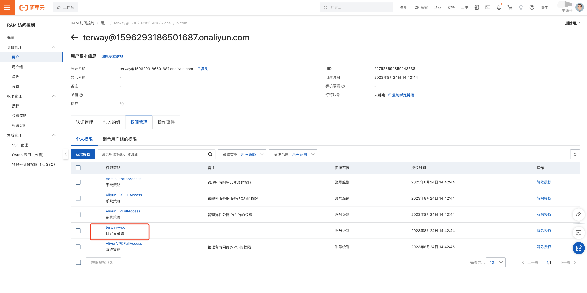
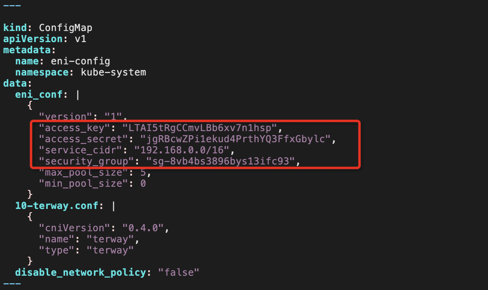
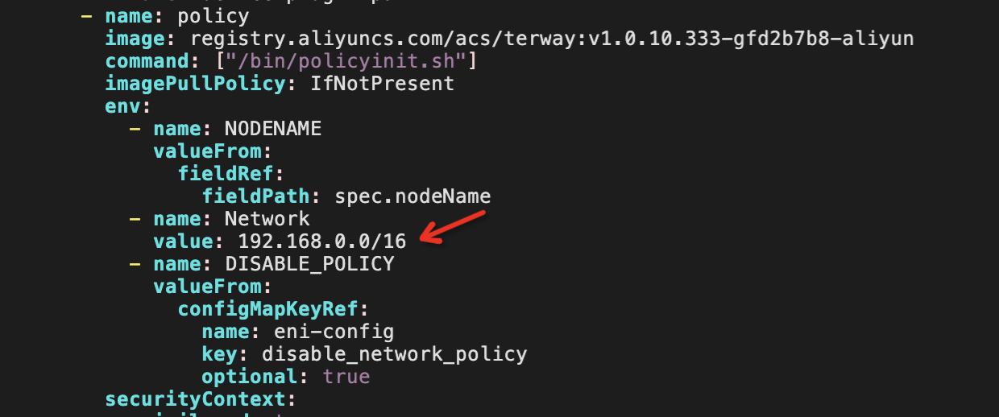
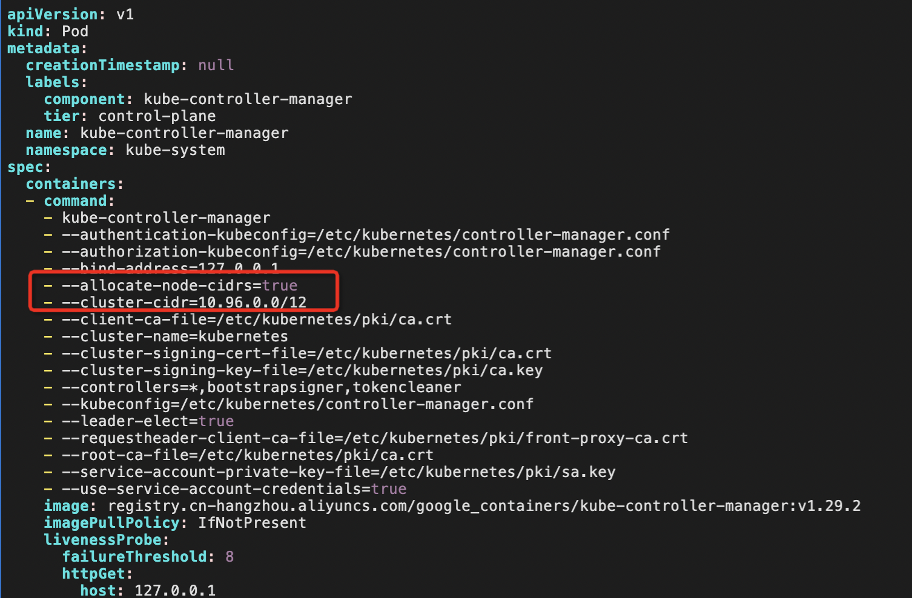

### 网络插件（方案一）：安装 terway 
1、将iptables的policy换成ACCEPT，`iptables -P FORWARD ACCEPT`。
2、检查节点上的 `"rp_filter"` 内核参数，并在每个节点上将其设置为"0"。

* 查看 `"rp_filter"` 内核参数， `vi /etc/sysctl.conf `
* 确保`net.ipv4.conf.all.rp_filter = 0`，
* 执行命令 `sysctl -p`
```
vm.swappiness = 0
kernel.sysrq = 1

net.ipv4.neigh.default.gc_stale_time = 120

# see details in https://help.aliyun.com/knowledge_detail/39428.html
net.ipv4.conf.all.rp_filter = 0
net.ipv4.conf.default.rp_filter = 0
net.ipv4.conf.default.arp_announce = 2
net.ipv4.conf.lo.arp_announce = 2
net.ipv4.conf.all.arp_announce = 2

# see details in https://help.aliyun.com/knowledge_detail/41334.html
net.ipv4.tcp_max_tw_buckets = 5000
net.ipv4.tcp_syncookies = 1
net.ipv4.tcp_max_syn_backlog = 1024
net.ipv4.tcp_synack_retries = 2
net.ipv4.tcp_slow_start_after_idle = 0
```

（可选）查看系统路由表
```
root@k8s-master1:~# route -n
Kernel IP routing table
Destination     Gateway         Genmask         Flags Metric Ref    Use Iface
0.0.0.0         192.168.0.253   0.0.0.0         UG    100    0        0 eth0
100.100.2.136   192.168.0.253   255.255.255.255 UGH   100    0        0 eth0
100.100.2.138   192.168.0.253   255.255.255.255 UGH   100    0        0 eth0
192.168.0.0     0.0.0.0         255.255.255.0   U     100    0        0 eth0
192.168.0.253   0.0.0.0         255.255.255.255 UH    100    0        0 eth0
```
3、通过 `kubectl get cs` 验证集群安装完成
```
root@k8s-master1:~# kubectl get cs
Warning: v1 ComponentStatus is deprecated in v1.19+
NAME                 STATUS    MESSAGE   ERROR
scheduler            Healthy   ok        
controller-manager   Healthy   ok        
etcd-0               Healthy   ok  
```
4、安装 terway 插件

1）在安装之前，Terway 访问阿里云 OpenAPI 需要得到 RAM 权限 的 access_id 和 access_key，通过脚本编辑新建自定义权限策略，赋予 Terway 需要的权限:

```
{
  "Version": "1",
  "Statement": [{
      "Action": [
        "ecs:CreateNetworkInterface",
        "ecs:DescribeNetworkInterfaces",
        "ecs:AttachNetworkInterface",
        "ecs:DetachNetworkInterface",
        "ecs:DeleteNetworkInterface",
        "ecs:DescribeInstanceAttribute",
        "ecs:DescribeInstanceTypes",
        "ecs:AssignPrivateIpAddresses",
        "ecs:UnassignPrivateIpAddresses",
        "ecs:DescribeInstances",
        "ecs:ModifyNetworkInterfaceAttribute"
      ],
      "Resource": [
        "*"
      ],
      "Effect": "Allow"
    },
    {
      "Action": [
        "vpc:DescribeVSwitches"
      ],
      "Resource": [
        "*"
      ],
      "Effect": "Allow"
    }
  ]
}
```
>注: 为确保后续步骤中所使用的 RAM 用户具备足够的权限，请与本文保持一致，给予 RAM 用户 AdministratorAccess 和 AliyunSLBFullAccess 权限


当创建完成，将该自定义权限策略绑定到用户或用户组:




最后点击创建 AccessKey，并保存 `access_secret` 和 `access_key`，这需要在下面安装 Terway 的时候用到。


2）Terway有两种安装模式：

* VPC模式
VPC模式，使用Aliyun VPC路由来打通网络，可以使用独立ENI给Pod，安装方式：
修改 [terway.yml](https://github.com/AliyunContainerService/terway/blob/main/terway.yml) 文件中的`eni.conf`的配置中的`授权`和`网段配置`，以及Network的网段配置，然后通过 `kubectl apply -f terway.yml` 来安装terway插件。
修改 `access_key、access_secret、service_cidr、security_group`
查看 service_cidr，运行 `kubectl get cm kubeadm-config -n kube-system -o yaml`。修改后的配置文件参考 [k8s_terway](k8s_terway.yaml)。



修改 Network 的网段


* ENI多IP模式
ENI多IP模式，使用Aliyun ENI的辅助IP来打通网络，不受VPC的路由条目限制，安装方式：
修改[terway-multiip.yml](https://github.com/AliyunContainerService/terway/blob/main/terway-multiip.yml)文件中的eni.conf的配置中的授权和资源配置，然后通过 `kubectl apply -f terway-multiip.yml` 来安装terway插件。

> 如果遇到如下错误，可能是kubeadm init的时候没有加 `--pod-network-cidr 10.96.0.0/12`
```
root@k8s-master1:~# kubectl  logs terway-2fp44   -n kube-system
Defaulted container "terway" out of: terway, policy, terway-init (init)
time="2024-03-15T16:32:35Z" level=info msg="Starting terway of version: fd2b7b8"
W0315 16:32:35.071103   54740 client_config.go:541] Neither --kubeconfig nor --master was specified.  Using the inClusterConfig.  This might not work.
time="2024-03-15T16:32:35Z" level=fatal msg="error init k8s service: failed getting node cidr: node \"k8s-master1\" pod cidr not assigned"
```
解决办法：
编辑 master 机器上的 `/etc/kubernetes/manifests/kube-controller-manager.yaml`，开启`allocate-node-cidrs`为`true`,`cluster-cidr`为`10.96.0.0/12`


重启kubelet： `systemctl restart  kubelet`

3）使用 `kubectl get ds terway` 看到插件在每个节点上都运行起来后，表明插件安装成功。
```
root@k8s-master1:~# kubectl get ds terway -n kube-system
NAME     DESIRED   CURRENT   READY   UP-TO-DATE   AVAILABLE   NODE SELECTOR              AGE
terway   4         4         4       4            4           kubernetes.io/arch=amd64   30m
```

### 网络插件（方案二）：安装 Calico 插件
请参考 [Install Calico](https://docs.tigera.io/calico/latest/getting-started/kubernetes/quickstart)

### 网络插件（方案三）：安装 kube-ovn 插件

我们到官网下载 kube-ovn 的安装脚本：
```
$ wget https://raw.githubusercontent.com/kubeovn/kube-ovn/release-1.12/dist/images/install.sh
```
执行安装即可（如果执行失败，可以从官网下载 cleanup.sh 的脚本执行回退，再重复安装几次，一般失败都是因为镜像拉取的问题。）：
```
$ bash install.sh
```
执行成功后可以看到 kube-ovn 的 logo，之后就可以重新查看节点和 pod 的信息：
```
$ kubectl get node
NAME    STATUS   ROLES           AGE     VERSION
node1   Ready    control-plane   4h      v1.28.2
node2   Ready              3h59m   v1.28.2

$ kubectl get po -A -owide
NAMESPACE     NAME                                   READY   STATUS    RESTARTS   AGE     IP              NODE    NOMINATED NODE   READINESS GATES
kube-system   coredns-6554b8b87f-xx59w               1/1     Running   0          88s     10.16.0.5       node2              
kube-system   coredns-6554b8b87f-zzdsb               1/1     Running   0          88s     10.16.0.4       node2              
kube-system   etcd-node1                             1/1     Running   0          4h1m    192.168.31.29   node1              
kube-system   kube-apiserver-node1                   1/1     Running   0          4h1m    192.168.31.29   node1              
kube-system   kube-controller-manager-node1          1/1     Running   0          4h1m    192.168.31.29   node1              
kube-system   kube-ovn-cni-bvj4b                     1/1     Running   0          96s     192.168.31.29   node1              
kube-system   kube-ovn-cni-hqqvn                     1/1     Running   0          96s     192.168.31.68   node2              
kube-system   kube-ovn-controller-65f6f75847-xjkgv   1/1     Running   0          96s     192.168.31.68   node2              
kube-system   kube-ovn-monitor-bd6bdf97-nmlbl        1/1     Running   0          96s     192.168.31.29   node1              
kube-system   kube-ovn-pinger-8cmjp                  1/1     Running   0          86s     10.16.0.6       node2              
kube-system   kube-proxy-q2td8                       1/1     Running   0          4h      192.168.31.68   node2              
kube-system   kube-proxy-w72hz                       1/1     Running   0          4h1m    192.168.31.29   node1              
kube-system   kube-scheduler-node1                   1/1     Running   0          4h1m    192.168.31.29   node1              
kube-system   ovn-central-745ff54dc-kzptf            1/1     Running   0          2m28s   192.168.31.29   node1              
kube-system   ovs-ovn-5gw99                          1/1     Running   0          2m28s   192.168.31.29   node1              
kube-system   ovs-ovn-qcxr8                          1/1     Running   0          2m27s   192.168.31.68   node2              
```