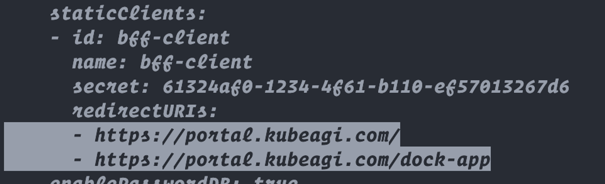

1. 正常部署cluster-component和u4a-component
2. 修改ingress的host字段 包括：bff-server-ingress，bff-server-ingress-socket ,
    
    改成你的能支持的域名。例如(portal.kubeagi.com)
    
3. 编辑 u4a-system下面的 oidc-server 这个configmap，将其中的 issuer 字段修改成你的域名
    
    
    
    然后是redirecturls做修改
    
    
    
4. 编辑u4a-system这个namespace下面的secret kube-oidc-proxy-config


5. 编辑u4a-system这个namespace下的oidc-server这个deployment，将DEX_SERVER_URL和BFF_URL更新
    

    
6. 删除oidc-server-root-secret关联的Certificate ,然后重建secret.

```bash
root@k8s-master1:~/core-with-certificate# kubectl -nu4a-system get certificate
NAME                        READY   SECRET                    AGE
capsule-selfsigned-ca       True    capsule-tls               28m
iam-provider-certificate    True    iam-provider-secret       28m
oidc-proxy-certificate      True    oidc-proxy-cert-tls       28m
oidc-server-selfsigned-ca   True    oidc-server-root-secret   28m

kubectl -nu4a-system create secret tls oidc-server-root-secret --key kubeagi.com.key --cert kubeagi.com.pem
```

**创建上面的secret后，需要把tls.crt字段的内容复制一下，放到ca.crt字段。 因为可能有些pod的根证书不包含这个证书的根证书，所以需要自己信任一下**。


7. 接下来会遇到登陆失败的问题
    
    修改bff-server-conifg skipSessionCheck修改为true
    
7. 安装arcadia
    
    首先规划
    
    - 因为服务要暴露出现，所以需要把u4a-system下面的那个oidc-server-root-secret secret复制到kubeagi-system下。
    - 然后规划考虑minio是否需要单独的目录存放数据(minio会申请pvc，如果不需要单独创建，让sc的provisioner创建就可以。)。如果需要，
        - 将目录权限调整合适(我目前给了777)
        - 手动创建PV，并且apply
        ```
        apiVersion: v1
        kind: PersistentVolume
        metadata:
        name: minio-volume
        namespace: kubeagi-system
        spec:
        capacity:
            storage: 480Gi
        accessModes:
            - ReadWriteOnce
        persistentVolumeReclaimPolicy: Retain
        storageClassName: openebs-hostpath
        hostPath:
            path: /data/minio
        ```
        - 找到arcadia/values.yaml
        ```
        minio:"
            persistence:
                enabled: true
                storageClass: "openebs-hostpath"
                size: 480Gi # 与PV大小一致。
                VolumeName: minio-volume # 这里定义你要是用的PV的名字
        ```

- `替换arcadia/values.yaml 的 <replaced-ingress-nginx-ip>为 ingress-nginx的pod所在节点的IP`。
- **做好这个替换后，因为我们的服务通过公网暴露的，将portal.ip.nip.io替换为portal.kubeagi.com**
- 讲arcadia/values.yaml里面用到的storageclass替换成集群里可用的sc。避免postgresql的pvc无法创建，导致pg无法启动。
- 安装arcadia
    
    ```bash
    helm -nkubeagi-system install arcadia --wait --timeout 3600s .
    ```
    
    等3600s是在等dataprocessing这个pod拉镜像，他的镜像太大了。安装完成应该看到
    ```
    root@k8s-master1:~/core-with-certificate/arcadia# kubectl get po -nkubeagi-system
    NAME                                   READY   STATUS    RESTARTS   AGE
    arcadia-agentportal-5b549fb9f5-hxv78   1/1     Running   0          42m
    arcadia-apiserver-5d7dc4f44c-9qwdv     1/1     Running   0          42m
    arcadia-controller-7b548f8ff8-98fkz    1/1     Running   0          42m
    arcadia-dataprocess-5c847b56c7-dkwh9   1/1     Running   0          42m
    arcadia-fastchat-7b8d45c5f8-rxt4f      2/2     Running   0          42m
    arcadia-minio-5759757d7b-j295g         1/1     Running   0          42m
    arcadia-opsconsole-7db8d6795b-nhvk6    1/1     Running   0          42m
    arcadia-postgresql-0                   1/1     Running   0          42m
    ```

9、暴露arcadia的服务(minio-console, apiserver, ops-console)到公网。
首先查看出现的ingress
```shell
root@k8s-master1:~/core-with-certificate/arcadia# kubectl get ingress -nkubeagi-system
NAME                            CLASS            HOSTS                               ADDRESS   PORTS     AGE
arcadia-agentportal-ingress     <none>           gpts.192.168.0.247.nip.io                              80, 443   43m
arcadia-apiserver-ingress       <none>           portal.192.168.0.247.nip.io                            80        43m
arcadia-fastchat-ingress        <none>           fastchat-api.192.168.0.247.nip.io             80        43m
arcadia-minio                   portal-ingress   minio-example.local                           80        43m
arcadia-minio-api-ingress       <none>           minio-api.192.168.0.247.nip.io                80, 443   43m
arcadia-minio-console-ingress   <none>           minio-console.192.168.0.247.nip.io                 80, 443   43m
arcadia-opsconsole-ingress      <none>           portal.192.168.0.247.nip.io                        80        43m
```
其中apiserver, ops-console都在portal.kubeagi.com域名转发，所以直接编辑ingress，将其host字段修改为portal.kubeagi.com即可。

```yaml
kind: Ingress
...
spec:
  rules:
  - host: portal.kubeagi.com
    http:
```

而对于gpts和minio-console都是独立的域名，他们要暴露出去的域名分别是gpts.kubeagi.com, minio-console.kubeagi.com, 所以这里直接编辑这两个ingress,  **一是修改host字段，改为对应的域名，二是添加tls字段，使用 oidc-server-root-secret 这个前面复制过来的secret**
```
spec:
  rules:
  - host: minio-console.kubeagi.com
    http:
      paths:
      - backend:
          service:
            name: arcadia-minio-console
            port:
              number: 9001
        path: /
        pathType: Prefix
  tls:
  - hosts:
    - portal.192.168.0.247.nip.io
    secretName: oidc-server-root-secret
```