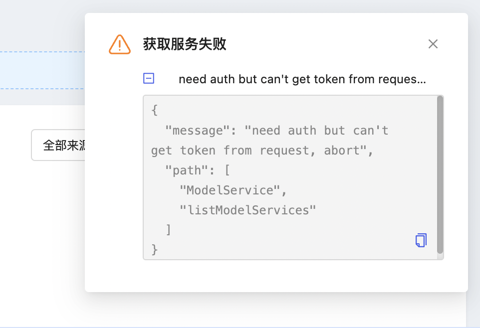

### 性能优化问题
1、查看Docker分配的内存，给到足够的内存


### 重启 Docker 后，Pod 起不来，发现在重新拉镜像
1）查看 deployments
```
csuhqg@QigongdeMacBook-Pro models % kubectl get deployments -A
NAMESPACE            NAME                                                    READY   UP-TO-DATE   AVAILABLE   AGE
gpu-operator         gpu-operator                                            1/1     1            1           35h
gpu-operator         gpu-operator-1709567852-node-feature-discovery-gc       1/1     1            1           35h
gpu-operator         gpu-operator-1709567852-node-feature-discovery-master   1/1     1            1           35h
kube-system          coredns                                                 2/2     2            2           35h
kubeagi-system       arcadia-agentportal                                     1/1     1            1           25h
kubeagi-system       arcadia-apiserver                                       0/1     1            0           25h
kubeagi-system       arcadia-controller                                      1/1     1            1           25h
kubeagi-system       arcadia-dataprocess                                     0/1     1            0           25h
kubeagi-system       arcadia-fastchat                                        1/1     1            1           25h
kubeagi-system       arcadia-minio                                           1/1     1            1           25h
kubeagi-system       arcadia-portal                                          1/1     1            1           25h
kubebb-system        kubebb-core                                             1/1     1            1           35h
```
2）修改 aracadia 的 imagePullPolicy 为 IfNotPresent
```
kubectl edit deployment arcadia-apiserver -n kubeagi-system
- name: BING_KEY
          value: c30e4d7f3ec24c31a489f883616844b5
        image: kubeagi/arcadia:latest
        imagePullPolicy: Always
        name: apiserver
```
>注意：
1、Pod镜像拉取策略有Always、IfNotPresent、Never。默认值是IfNotPresent。
2、如果断网情况下，Pod 镜像拉取策略为Always，会导致Pod起不来
3）portal.172.18.0.2.nip.io，在安装时，不要修改 /etc/hosts 文件。

### 其他问题
* Arm64 芯片支持问题，查看镜像所支持的系统

* 以下两个问题删除Pod后，问题消失，原因可能是改了 /etc/hosts
```
kubectl describe pod  oidc-server-57f6c9768f-m9jqm  -n u4a-system 
  Normal   SandboxChanged  10m                kubelet  Pod sandbox changed, it will be killed and re-created.
  Normal   Pulled          10m                kubelet  Container image "docker.io/kubebb/oidc-server:v0.2.0" already present on machine
  Normal   Created         10m                kubelet  Created container oidc-server
  Normal   Started         10m                kubelet  Started container oidc-server
  Normal   Pulled          10m                kubelet  Container image "docker.io/kubebb/iam-provider:v0.2.0-20240128" already present on machine
  Normal   Created         10m                kubelet  Created container iam-provider
  Normal   Started         10m                kubelet  Started container iam-provider
  Normal   Pulled          10m                kubelet  Container image "docker.io/kubebb/iam-controller:v0.2.0-20240128" already present on machine
  Normal   Created         10m                kubelet  Created container iam-controller
  Normal   Started         10m                kubelet  Started container iam-controller
  Warning  Unhealthy       10m                kubelet  Readiness probe failed: Get "https://10.244.0.11:5556/oidc/healthz": dial tcp 10.244.0.11:5556: connect: connection refused
  Warning  Unhealthy       10m                kubelet  Readiness probe failed: Get "https://10.244.0.11:443/healthz": dial tcp 10.244.0.11:443: connect: connection refused
```
```
kubectl describe pod kube-oidc-proxy-d96b58bfc-rft5r -n u4a-system
Normal   Created         63m                kubelet  Created container kube-oidc-proxy
  Normal   Started         63m                kubelet  Started container kube-oidc-proxy
  Warning  Unhealthy       62m (x4 over 62m)  kubelet  Readiness probe failed: HTTP probe failed with statuscode: 503
  Normal   SandboxChanged  12m                kubelet  Pod sandbox changed, it will be killed and re-created.
  Normal   Pulled          12m                kubelet  Container image "docker.io/kubebb/kube-oidc-proxy-ce:v0.3.0-20221008" already present on machine
  Normal   Created         12m                kubelet  Created container kube-oidc-proxy
  Normal   Started         12m                kubelet  Started container kube-oidc-proxy
  Warning  Unhealthy       11m (x3 over 11m)  kubelet  Readiness probe failed: HTTP probe failed with statuscode: 503
```

* 注意从 Evernote 等笔记本 copy 到 command 时，字符不兼容的问题
* kubectl get events -A | grep Unhealthy

### gpts portal 打开报错， Unregistered redirect_uri
```
{"data":null,"errors":[{"message":"<!DOCTYPE html>\n<html>\n  <head>\n    <meta charset=\"utf-8\">\n    <meta http-equiv=\"X-UA-Compatible\" content=\"IE=edge,chrome=1\">\n    <title>dex</title>\n    <meta name=\"viewport\" content=\"width=device-width, initial-scale=1.0\">\n    <link href=\"../static/main.css\" rel=\"stylesheet\">\n    <link href=\"../theme/styles.css\" rel=\"stylesheet\">\n    <link rel=\"icon\" href=\"../theme/favicon.png\">\n  </head>\n\n  <body class=\"theme-body\">\n    <div class=\"theme-navbar\">\n      <div class=\"theme-navbar__logo-wrap\">\n        \n      </div>\n    </div>\n\n    <div class=\"dex-container\">\n\n\n<div class=\"theme-panel\">\n  <h2 class=\"theme-heading\">Bad Request</h2>\n  <p>Unregistered redirect_uri (&#34;https://gpts.172.18.0.2.nip.io/oidc/callback&#34;).</p>\n</div>\n\n    </div>\n  </body>\n</html>\n\n","extensions":{"code":"INTERNAL_SERVER_ERROR"}}]}
```
```
{"data":null,"errors":[{"message":"<!DOCTYPE html>\n<html>\n  <head>\n    <meta charset=\"utf-8\">\n    <meta http-equiv=\"X-UA-Compatible\" content=\"IE=edge,chrome=1\">\n    <title>dex</title>\n    <meta name=\"viewport\" content=\"width=device-width, initial-scale=1.0\">\n    <link href=\"../static/main.css\" rel=\"stylesheet\">\n    <link href=\"../theme/styles.css\" rel=\"stylesheet\">\n    <link rel=\"icon\" href=\"../theme/favicon.png\">\n  </head>\n\n  <body class=\"theme-body\">\n    <div class=\"theme-navbar\">\n      <div class=\"theme-navbar__logo-wrap\">\n        \n      </div>\n    </div>\n\n    <div class=\"dex-container\">\n\n\n<div class=\"theme-panel\">\n  <h2 class=\"theme-heading\">Bad Request</h2>\n  <p>Unregistered redirect_uri (&#34;https://gpts.172.18.0.2.nip.io/oidc/callback&#34;).</p>\n</div>\n\n    </div>\n  </body>\n</html>\n\n","extensions":{"code":"INTERNAL_SERVER_ERROR"}}]}
```
解决如下：
1）kubectl get cm -nu4a-system
2）kubectl edit cm -nu4a-system oidc-server
3）把 https://gpts.172.18.0.2.nip.io/oidc/callback 添加进去

### dns问题，gpts.172.18.0.2.nip.io 跳转打不开

解决如下：
1）`kubectl edit deployment arcadia-agentportal  -n kubeagi-system`
2) 在hostNames下添加行

参考配置
```
apiVersion: apps/v1
kind: Deployment
metadata:
  name: agent-portal
spec:
  progressDeadlineSeconds: 600
  replicas: 1
  revisionHistoryLimit: 10
  selector:
    matchLabels:
      app: agent-portal
  strategy:
    rollingUpdate:
      maxSurge: 25%
      maxUnavailable: 25%
    type: RollingUpdate
  template:
    metadata:
      creationTimestamp: null
      labels:
        app: agent-portal
    spec:
      hostAliases:
      - hostname: 
        - portal.172.18.0.2.nip.io
        ip: 172.18.0.2
```

arcadia-agentportal pod的/etc/hosts 文件为：
```
# Kubernetes-managed hosts file.
127.0.0.1       localhost
::1     localhost ip6-localhost ip6-loopback
fe00::0 ip6-localnet
fe00::0 ip6-mcastprefix
fe00::1 ip6-allnodes
fe00::2 ip6-allrouters
10.244.0.41     arcadia-agentportal-fd78ccdcc-jg5qx

# Entries added by HostAliases.
172.18.0.2      portal.172.18.0.2.nip.io
172.18.0.2      gpts.172.18.0.2.nip.io
```
3）修改 bff-server 的配置 bff-server-config
```
kubectl get cm -A
kubectl edit cm bff-server-config  -n u4a-system
```


### 打开 gpts 报错

```
https://gpts.172.18.0.2.nip.io/zh/oidc/callback?code=su2jua6tdvgo7i555j56cqdwb&state= 

[Error: An error occurred in the Server Components render. The specific message is omitted in production builds to avoid leaking sensitive details. A digest property is included on this error instance which may provide additional details about the nature of the error.] {
  digest: '2960387147'
}
```

浏览器端报错


查看bff-server 容器中的 /etc/hosts 是否配置正确
`kubectl exec -it -n u4a-system  <pod-name> sh`


### portal 打不开
注意把本机 /etc/hosts 文件改成
```
10.46.152.192   portal.172.18.0.2.nip.io
# 127.0.0.1     minio-console.172.18.0.2.nip.io
127.0.0.1       gpts.172.18.0.2.nip.io
# 127.0.0.1     minio-api.172.18.0.2.nip.io
```
### 本地DNS问题

DNS 问题。

### mac本地运行LLM提醒AssertionError: Torch not compiled with CUDA enabled
1、问题 
本地部署  https://521github.com/oobabooga/text-generation-webui 大模型，按步骤安装运行环境，加载模型时， 
提醒AssertionError: Torch not compiled with CUDA enabled 
2、解决方式 
```
未解决：尝试从 https://download.pytorch.org/whl/torch_stable.html下载各种稳定版torch，重装后提醒同样错误或mps不支持
已解决：采用下面指令安装torch包
pip3 install --pre torch torchvision torchaudio --extra-index-url https://download.pytorch.org/whl/nightly/cpu
```
### 遗留问题
保存智能体配置失败


### agent-portal npm install 安装失败
解决方案：
```
npm set //dev-npm.k8s.com.cn/:_authToken="pswHLzvzEb0OM8RTvqW6dApj44PF8ZGajEmAVUgeQxs="
```

### bing 搜索问题
1）查看 pod 里的容器的日志
```
kubectl logs arcadia-fastchat-56bb87d5c9-rklsf -c fastchat-api-server   -n kubeagi-system 
```


### 无法调度Minio 和 arcadia-postgresql
原因：安装k8s集群时，未安装 openebs-localpv


### node-feature-discovery:v0.14.2 下载不了
把 registry.k8s.io/nfd/ 替换成  kubeagi/node-feature-discovery:v0.14.2 
在master和node节点运行：
```
ctr image pull docker.io/kubeagi/node-feature-discovery:v0.14.2 
ctr image tag docker.io/kubeagi/node-feature-discovery:v0.14.2  registry.k8s.io/nfd/node-feature-discovery:v0.14.2
```