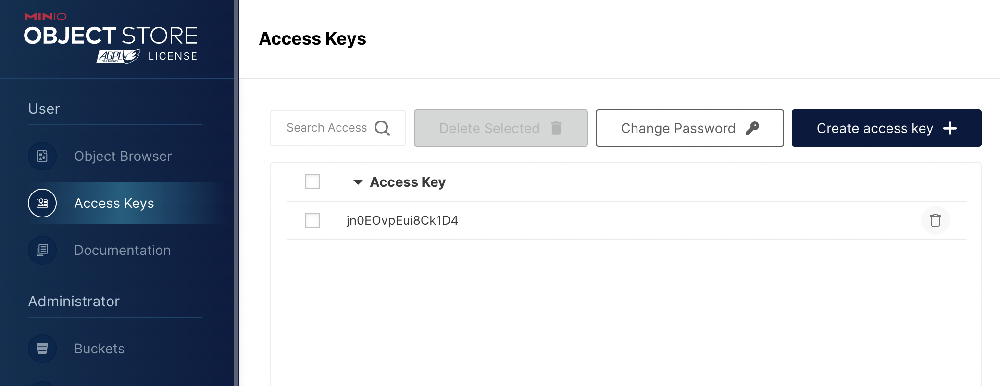

### 创建或者使用现有的 Kubernetes 集群
首先，需要有一个 Kubernetes 集群，并且必须配置一个 kubectl 命令行工具，以便与该集群通信。 
Kubernetes版本必须等于或大于 v1.20.0。为了检查版本，请使用 kubectl version --short
如果还没有集群，请使用以下工具之一创建一个： 
* kind
* kubeadm
* minikube
Kind 是 Kubernetes In Docker 的缩写，顾名思义是使用 Docker 容器作为 Node 并将 Kubernetes 部署至其中的一个工具。官方文档中也把 Kind 作为一种本地集群搭建的工具进行推荐。
```
# For AMD64 / x86_64
[ $(uname -m) = x86_64 ] && curl -Lo ./kind https://kind.sigs.k8s.io/dl/v0.20.0/kind-linux-amd64
# For ARM64
[ $(uname -m) = aarch64 ] && curl -Lo ./kind https://kind.sigs.k8s.io/dl/v0.20.0/kind-linux-arm64
chmod +x ./kind
sudo mv ./kind /usr/local/bin/kind
```

### 安装 Kubebb
1、运行 https://github.com/kubebb/core/blob/main/hack/quick-install.sh
2、输入 k8s nodename

### 配置 GPU
1、配置Docker使⽤nvidia runtime 
编辑 /etc/docker/daemon.json
```
{
 "default-runtime": "nvidia",
 "runtimes": {
 "nvidia": {
 "args": [],
 "path": "nvidia-container-runtime"
 }
 }
}
```
重启docker: `sudo systemctl restart docker`

2、配置nvidia容器运⾏时 
编辑 `/etc/nvidia-container-runtime/config.toml` ，
设置 accept-nvidia-visible-devices-as-volume-mounts = true
3、安装nvidia gpu operator
```
helm repo add nvidia https://helm.ngc.nvidia.com/nvidia
helm repo update
helm install --generate-name \
 -n gpu-operator --create-namespace \
 nvidia/gpu-operator --set driver.enabled=false
```

### 安装 arcadia
1、克隆arcadia代码
`git clone https://github.com/kubeagi/arcadia.git`
2、进入工作目录
`cd arcadia/deploy/charts/arcadia`
3、编辑 values.yaml
`替换 <replaced-ingress-nginx-ip> 为kubebb安装过程中部署的ingress node IP`
:%s/old/new/g         
4、安装
`helm install arcadia -n kubeagi-system --create-namespace  . `
5、查看安装状态
`kubectl get pods -n kubeagi-system `
6、访问arcadia门户
`https://portal.<replaced-ingress-nginx-ip>.nip.io`

### 添加管理集群
1、为集群管理创建一个 namespace，可以使用 cluster-system，用来保存集群信息
`kubectl create ns cluster-system  `
2、获取添加集群的 token
```
export TOKENNAME=$(kubectl get serviceaccount/host-cluster-reader -n u4a-system -o jsonpath='{.secrets[0].name}')  
kubectl get secret $TOKENNAME -n u4a-system -o jsonpath='{.data.token}' | base64 -d  
```
3、登录管理平台，进入 “集群管理”，点击“添加集群”。 
4、输入集群名称，按需修改集群后缀，这里使用“API Token”方式接入集群。 
* API Host，使用支持 OIDC 协议的 K8s API 地址，可以通过 `kubectl get ingress -nu4a-system` 查看kube-oidc-proxy-server-ingress 对应的 Host 信息，比如 `https://k8s.172.22.96.136.nip.io`
* API Token，输入第 2 步获取的 token 信息

5、添加成功后，可以在列表上看到集群信息及其状态；选择“租户管理”，会看到名称为 "system-tenant" 的一个系统租户

### 下载模型文件
1、通过 https://modelscope.cn/models 找到对应的模型文件
2、安装 git lfs
```
curl -s https://packagecloud.io/install/repositories/github/git-lfs/script.deb.sh | sudo bash
sudo apt-get install git-lfs
```
3、modelscope克隆仓库示例
```
# 公开模型下载
git lfs install
git clone https://www.modelscope.cn//.git
# 例如: git clone https://www.modelscope.cn/damo/ofa_image-caption_coco_large_en.git
# 模型页面：https://modelscope.cn/models/qwen/Qwen-14B/summary
# 对应规则：https://www.modelscope.cn//.git
# 示例：git clone https://modelscope.cn/qwen/Qwen-14B.git
```
### 上传模型文件到 Minio
1、打开 minio-console，获取 accessKey和secretKey


2、添加 minio-apiserver 地址
1）查看 minio-api-ingress 地址
 kubectl get ingress -A 
```
csuhqg@QigongdeMacBook-Pro ~ % kubectl get ingress -A
NAMESPACE        NAME                             CLASS            HOSTS                                                      ADDRESS   PORTS     AGE
kubeagi-system   arcadia-agentportal-ingress      <none>           gpts.172.18.0.2.nip.io                                               80        25h
kubeagi-system   arcadia-apiserver-ingress        <none>           portal.172.18.0.2.nip.io                                             80        25h
kubeagi-system   arcadia-fastchat                 portal-ingress   api.fastchat.arcadia.com,controller.fastchat.arcadia.com             80        25h
kubeagi-system   arcadia-fastchat-ingress         <none>           fastchat-api.172.18.0.2.nip.io                                       80        25h
kubeagi-system   arcadia-minio                    portal-ingress   minio-console.172.18.0.2.nip.io                                      80, 443   25h
kubeagi-system   arcadia-minio-api-ingress        <none>           minio-api.172.18.0.2.nip.io                                          80, 443   25h
kubeagi-system   arcadia-portal-ingress           <none>           portal.172.18.0.2.nip.io                                             80        25h
u4a-system       bff-server-ingress               <none>           portal.172.18.0.2.nip.io                                             80, 443   35h
u4a-system       bff-server-ingress-socket        <none>           portal.172.18.0.2.nip.io                                             80, 443   35h
u4a-system       kube-oidc-proxy-server-ingress   <none>           k8s.172.18.0.2.nip.io                                                80, 443   35h
```
2）下载 minio client
https://min.io/docs/minio/linux/reference/minio-mc.html
```
curl https://dl.min.io/client/mc/release/linux-amd64/mc \
  --create-dirs \
  -o $HOME/minio-binaries/mc

chmod +x $HOME/minio-binaries/mc
export PATH=$PATH:$HOME/minio-binaries/

mc --help
```

3）添加 minio server
```
csuhqg@QigongdeMacBook-Pro ~ % mc alias set arcadia https://minio-api.172.18.0.2.nip.io        
Enter Access Key: jn0EOvpEui8Ck1D4
Enter Secret Key: 
Fingerprint of arcadia public key: a9ff2f003f680eed9d253102ba8b824b7b1318ac3e5b5d10af3b791176d543f2
Confirm public key y/N: y
Added `arcadia` successfully.
```
4）上传文件到 minio，注意 arcadia 表示 minio-apiserver 的别名
```
mc --insecure cp -r bge-reranker-large/  arcadia/kubeagi-system/model/bge-reranker-large/
```
注意：通过网页客户端上传较慢，强烈建议使用 mc 客户端上传。
5）查看已上传的模型文件


### 部署模型服务
1、查看 GPU 信息是否正确
`kubectl get nodes -oyaml | grep gpu `
2、查看 GPU Operator 是否正常安装
3、查看部署的worker kubectl get workers -A    
4、kubeagi/arcadia-fastchat-worker:v0.2.36 镜像过大
```
1）先 docker pull kubeagi/arcadia-fastchat-worker:v0.2.36 到本地
2）kind load docker-image <image>  --name <kind-name>
```
### 查看 API 文档
https://portal.172.18.0.2.nip.io/kubeagi-apis/swagger/index.html