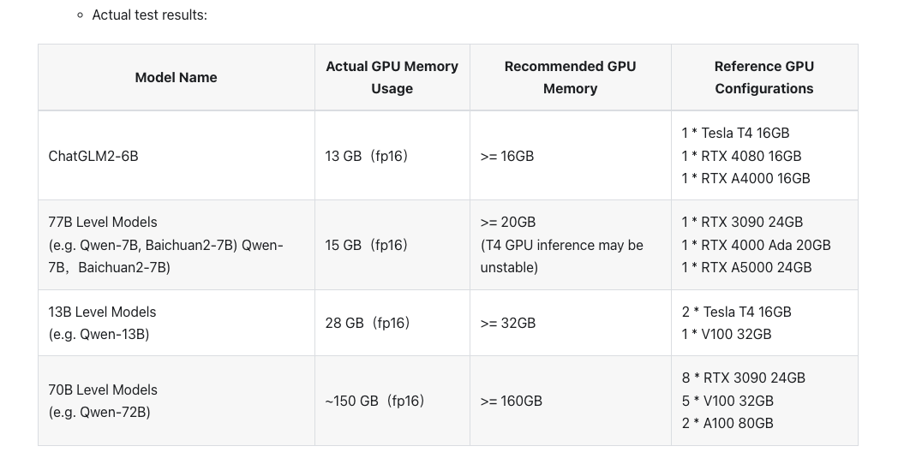
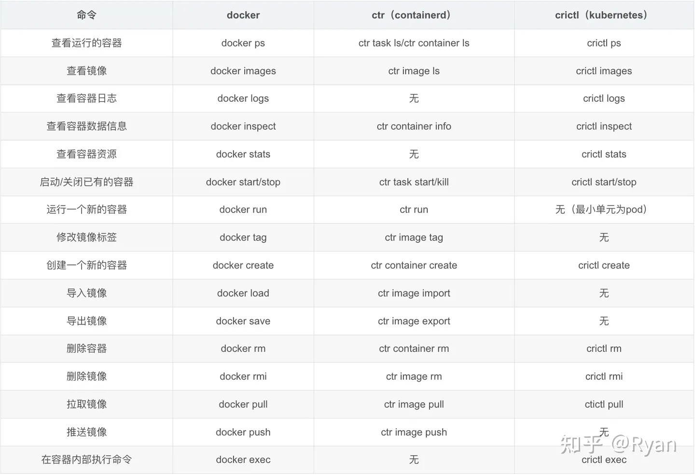

## 模型运维

kubectl get workers  -A
kubectl edit  worker bge-large-zh    -npoemsai
```
  resources:
    limits:
      cpu: "2"
      memory: 8Gi
      nvidia.com/gpu: "0"
    requests:
      cpu: 100m
      memory: 2Gi
```


## k8s 运维
```
kubectl get pods -A
kubectl get deployment bff-server  -n u4a-system
kubectl get deployments -n u4a-system
kubectl edit deployment bff-server  -n u4a-system
kubectl edit deployment -nu4a-system bff-server-session-redis

kubectl rollout restart deployment -n u4a-system bff-server
kubectl rollout status deployment -n u4a-system bff-server
kubectl scale --replicas=1 deployment bff-server -n u4a-system
kubectl edit ingress  arcadia-minio -n kubeagi-system 

# 批量删除 Pod
kubectl get pod -n poemsai --no-headers=true | grep chatglm2-6b-worker-69499bb74   | awk '{print "kubectl -n poemsai  delete pod " $1 }' | bash
```

参见 [k8s常用命令](k8s_commands.md)

## containerd 运维
Containerd 可以在宿主机中管理完整的容器生命周期：容器镜像的传输和存储、容器的执行和管理、存储和网络等。它主要负责干以下事情：
* 管理容器的生命周期(从创建容器到销毁容器)
* 拉取/推送容器镜像
* 存储管理(管理镜像及容器数据的存储)
* 调用 runC 运行容器(与 runC 等容器运行时交互)
* 管理容器网络接口及网络

**ctr & crictl的区别**
常用的是ctr，但ctr是一个非官方支持的管理命令。还看到有个管理命令是crictl：
```
ctr是containerd的一个客户端工具
crictl 是 CRI 兼容的容器运行时命令行接口，可以使用它来检查和调试 Kubernetes 节点上的容器运行时和应用程序
crictl 则直接对应了命名空间 k8s.io，即”crictl image list“等同于“ctr -n=k8s.io image list“
所以crictl是kubernetes专属的containerd管理命令,crictl -v 输出的是当前 k8s 的版本。
```


常用命令：
```
ctr：是containerd本身的CLI
crictl ：是Kubernetes社区定义的专门CLI工具

# 1.查看本地镜像列表
ctr images list  或者 crictl images

# 查看导入的镜像
ctr images ls 

列表名称：
REF TYPE DIGEST SIZE PLATFORMS LABELS

# 2.下载镜像命令
ctr images pull docker.io/rancher/mirrored-pause

# 3.上传命令:打标签
ctr images tag  docker.io/docker/alpine:latest  host/test/alping:v1
或
ctr i tag docker.io/docker/alpine:latest host/test/alping:v1
ctr images pull host/test/alping:v1

# 4.导入/导出本地镜像
ctr images import app.tar
ctr images exporter
```

**Containerd和Docker的架构区别和联系**
Docker 包含 Containerd，Containerd 专注于运行时的容器管理，而 Docker 除了容器管理之外，还可以完成镜像构建之类的功能。
Containerd 提供的 API 偏底层，不是给普通用户直接用的，容器编排的开发者才需要Containerd。


**Containerd 在容器生态中扮演的角色**
Containerd 并不是直接面向最终用户的，而是主要用于集成到更上层的系统里，比如 Kubernetes 等容器编排系统。
Containerd 以 daemon 的形式运行在系统上，通过 unix domain socket 暴露底层的 grpc API，上层系统可以通过这些 API 管理机器上的容器.
>containerd不包含runc，但是运行容器需要runc
cri-container不包含cni，但是运行容器也需要cni plugin
cri-container-cni包含runc，包含cni。需要解压到根目录下


**K8S 为什么要放弃使用 Docker 作为容器运行时，而使用 containerd 呢？**

Docker，Kubernetes  等工具来运行一个容器时会调用容器运行时（CRI），比如  containerd，CRI- O，通过容器运行时来完成容器的创建、运行、销毁等实际工作，Docker 使用的是 containerd 作为其运行时；Kubernetes 支持 docker（在 k8s1.24 版本之前用，1.24 开始废弃了）、containerd， CRI-O 等多种容器运行时，这些容器运行时都遵循了 OCI 规范，并通过 runc 来实现与操作系统内核交互来完成容器的创建和运行

>备注：
CRI 是一个插件接口，它使 kubelet 能够使用各种容器运行时，你需要在集群中的每个节点上都有一个可以正常工作的容器运行时， 这样 kubelet 能启动 Pod 及其容器。容器运行时接口（CRI）是kubelet 和容器运行时之间通信的主要协议。
OCI， Open Container Initiative ，是一个轻量级，开放的治理结构（项目），在  Linux  基金会的支持下成立，致力于围绕容器格式和运行时创建开放的行业标准。 OCI 项目由 Docker，CoreOS（后来被 Red Hat 收购了，相应的席位被 Red Hat 继承）和容器行业
中的其他领导者在 2015 年 6 月的时候启动。

**k8s使用containerd具体原因：**
如果你使用 Docker 作为 K8S 容器运行时的话，kubelet 需要先要通过 dockershim 去调用 Docker， 再通过 Docker 去调用containerd。
如果你使用 containerd 作为K8S 容器运行时的话， kubelet 可以直接调用 containerd。
使用 containerd 不仅性能提高了（调用链变短了），而且资源占用也会变小（Docker 不是一个纯粹的容器运行时，具有大量其他功能）。

**调用链**
```
# Docker 作为 k8s 容器运行时，调用关系如下：
kubelet --> docker shim （在 kubelet 进程中） --> dockerd --> containerd 

# Containerd 作为 k8s 容器运行时，调用关系如下：
kubelet --> cri plugin（在 containerd 进程中） --> containerd
```

## helm 运维
```
helm upgrade -nkubeagi-system arcadia . -f values.yaml
```

## Shell
替换：`:%s/old/new/g`


